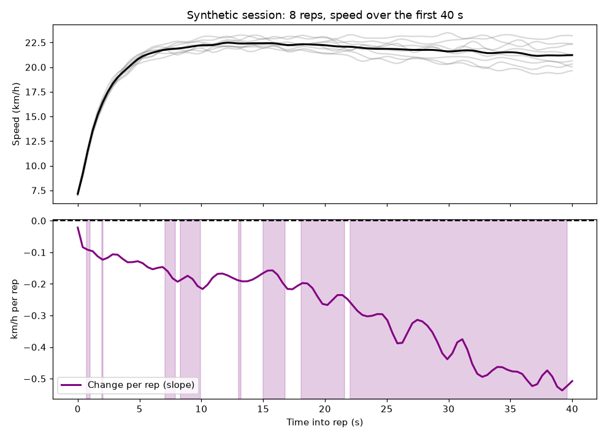

# Interval Lab

A Streamlit app that analyses the speed trace of interval sessions recorded on a GPS watch (Garmin `.FIT` files). It answers three questions about a set of reps:

1. **How was each rep run?** For a single rep it finds the moment the runner stopped accelerating and started holding speed (a two-segment linear fit), and reports peak speed, average speed and peak acceleration.
2. **Where in the rep do two groups of reps differ?** Compare, for example, the first three reps with the last three. Statistical parametric mapping (SPM) tests the whole speed curve rather than a single summary number. Choose a two-sample t-test (Welch) or a non-parametric permutation test; the effect size (Cohen's d) is plotted across the rep.
3. **Where in the rep does fatigue show?** A regression of speed on rep number at every point in the rep shows how much speed is lost per rep, and where that trend is statistically significant.



*Fatigue Trend tab on the synthetic session in `sample-data/`. Top: each rep (grey) and the mean (black). Bottom: change in speed per rep at each moment of the rep; shaded spans are statistically significant (p < 0.05).*

## Run it

```bash
pip install -r requirements.txt
streamlit run dashboard.py
```

Upload your own `.FIT` file, or try `sample-data/synthetic-intervals.fit`.

Tested with Python 3.14, Streamlit 1.64, spm1d 0.4.54, pandas 3.0 and NumPy 2.5 (September 2026).

## How it works

- Reads `record` messages (timestamp and `enhanced_speed`) and `lap` messages. Each lap is treated as one rep, so if your watch records recoveries as laps, select only the work laps.
- Resamples speed to 10 Hz with cubic interpolation, and derives acceleration from the change in speed, smoothed over 0.5 s.
- For the group and trend tabs, each rep is trimmed to the analysis window and time-normalised to 100 points. Set the window no longer than your shortest rep: reps shorter than the window are dropped and listed under Warnings.
- SPM uses [spm1d](https://spm1d.org): `ttest2` with unequal variances, or `nonparam.ttest2` for the permutation test, and `regress` for the fatigue trend.

## Checking it against a known answer

`sample-data/synthetic-intervals.fit` is simulated, not recorded: 8 reps of 45 s with a fatigue trend built in. Peak speed falls by 0.05 m/s per rep, and after 15 s each rep fades a little more than the one before. Between 22 s and 40 s into the rep, the built-in decline averages 0.41 km/h per rep. The Fatigue Trend tab flags a significant decline from 22 s to the end of the window and recovers 0.41 km/h per rep (shown as 0.4 in the app).

`sample-data/make_synthetic_fit.py` regenerates the file (it needs `pip install fit-tool`).

## Reading the results carefully

- Reps from one session are not independent samples: they come from one athlete on one day. Treat the p-values as a guide to where differences sit within that session, not as evidence that generalises to other athletes or sessions.
- Watch GPS speed is usually logged about once a second. Resampling to 10 Hz aligns and smooths the trace but adds no information, and acceleration derived from GPS speed is noisy.
- A permutation test needs at least 3 reps per group to reach p < 0.05 (20 possible permutations). With fewer, the app says so instead of running it.

## Author

Alan Ruddock, exercise physiologist, Sheffield Hallam University ([alanruddock.com](https://alanruddock.com)).
